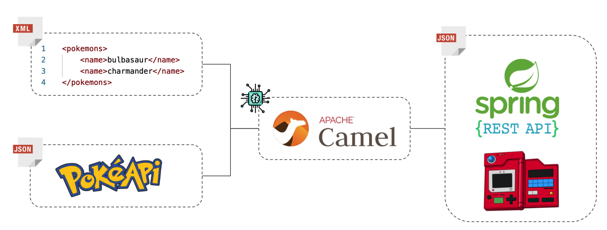

# Introdução à Integração de Sistemas Utilizando Apache Camel

Este projeto faz parte de uma publicação no Medium cujo o assunto é a integração entre sistemas utilizando Apache Camel. A estrutura do projeto segue a estrutura abaixo:

A aplicação tem como objetivo utilizar o Apache Camel para ler um arquivo XML e, para cada nome de Pokémon que consta na lista, buscar suas informações na PokéAPI. Por fim, os dados consultados na PokéAPI serão gravados em uma simulação de Pokedéx que fornece uma interface de integração via API Rest.